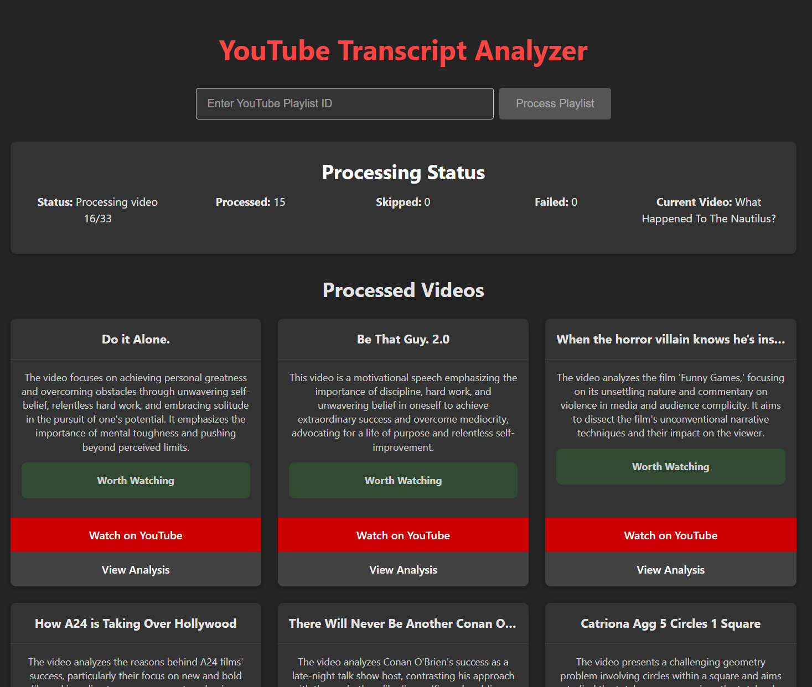
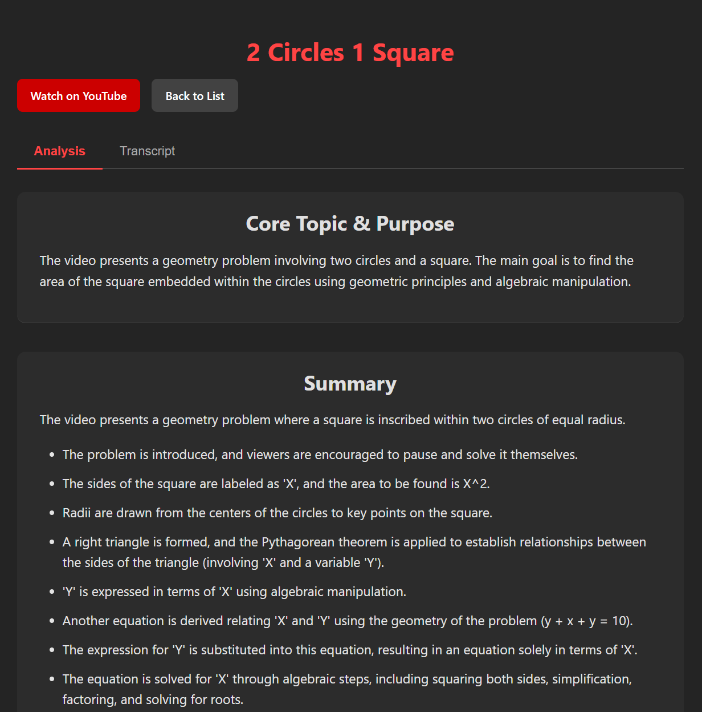

# YouTube Transcript Analyzer

<div align="center">
  
</div>

A modern web application that analyzes YouTube playlist content using AI. Extract transcripts, generate summaries, and get AI-powered insights to quickly determine if videos are worth watching.

## Features

- 🎬 **Playlist Processing**: Analyze entire YouTube playlists with one click
- 🤖 **AI Analysis**: Generate summaries, key takeaways, and topic classifications
- 📝 **Content Evaluation**: Get "worth watching" verdicts with justifications
- 📊 **Structured Insights**: Understand video organization and key points
- 🏷️ **Smart Categorization**: Reliable category tagging with JSON-based AI responses
- 📱 **Responsive Design**: Modern interface that works on all devices

## Screenshots

<div align="center">
  
  
</div>

## Tech Stack

**Frontend:** React, TypeScript, Vite, React Router, Axios, React Markdown  
**Backend:** FastAPI, SQLAlchemy, SQLite, YouTube API, Gemini AI

## Quick Setup

### Prerequisites
- Node.js 22+ and npm
- Python 3.13+ with `uv`
- Google Cloud Project with YouTube Data API
- Gemini API key

### Backend Setup
```bash
cd backend
uv sync
# Create client_secrets.json and .env files (see backend README)
python authenticate_youtube.py
uvicorn app.main:app --reload
```

### Frontend Setup
```bash
cd frontend
npm install
npm run dev
```

Access the app at [http://localhost:5173](http://localhost:5173)

## Project Structure

```
.
├── frontend/             # React frontend
├── backend/              # FastAPI backend
│   ├── app/              # Application code
│   ├── authenticate_youtube.py  # YouTube auth script
│   └── token.pickle      # Generated auth token
└── screenshots/          # Application screenshots
```

## Key Features Explained

### AI-Powered Analysis

The application uses Google's Gemini AI to analyze video transcripts and generate structured insights:

- **JSON-Based Responses**: AI outputs are structured as JSON for reliable parsing and consistent results
- **Smart Category Extraction**: Multiple fallback systems ensure videos always have relevant categories
- **Markdown Support**: All AI-generated content is rendered with full Markdown formatting

### Real-Time Processing

- Processing status updates in real-time
- Videos are automatically refreshed when analysis completes
- Progress indicators show exactly what's happening

## Documentation

For detailed setup instructions and development guides:
- [Frontend Documentation](./frontend/README.md)
- [Backend Documentation](./backend/README.md)

## Troubleshooting

- **YouTube Authentication Issues**: Delete `token.pickle` and run `python authenticate_youtube.py` again
- **CORS Errors**: Ensure both frontend and backend servers are running
- **Missing Analysis**: Check your Gemini API key and quota limits

## License

MIT 